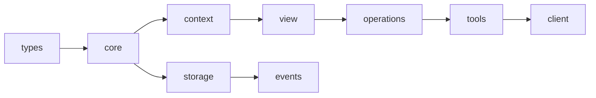
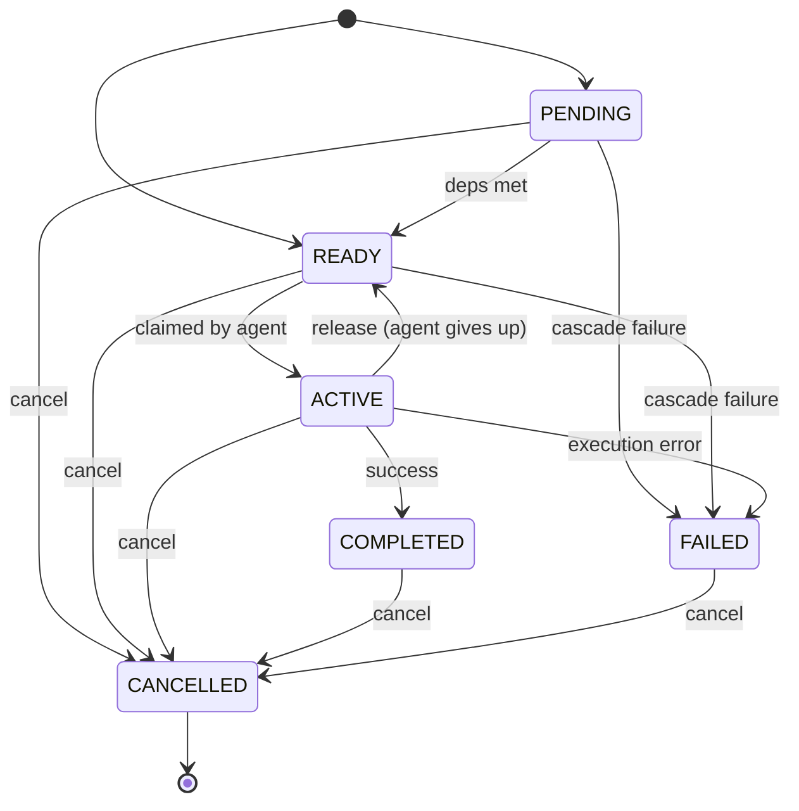
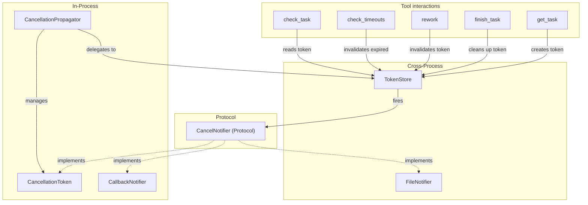

<!-- Copyright 2026 Hangzhou Autoseek Information Technology Co., Ltd.
     Licensed under the Apache License, Version 2.0 -->

# Cascade Architecture

## System Overview

Cascade is an agent factory with dynamic DAG scheduling. Orchestrator agents build and adapt task graphs in real time while stateless worker agents claim, execute, and deliver tasks -- coordinating through contracts on edges and attributed context flow. The graph supports mid-execution mutations (split, rework, refine, remove) and provides both in-process and cross-process cancellation, with every mutation recorded in an append-only event log.

## Module Dependency DAG

All module dependencies form a verified DAG with no circular imports. The arrow direction indicates "depends on."



| Package | Purpose |
|---------|---------|
| `types` | Value types: `Contract`, `Context`, `ContextEntry`, `TokenStatus`, `EdgeId` |
| `core` | `Cascade` graph, `Node`, `NodeState` (6-state FSM) |
| `context` | BFS ancestor propagation + cancellation (in-process) |
| `view` | Upstream view builder (`get_node_view`) |
| `events` | Append-only event log |
| `operations` | Compound mutations: Split, Remove, Rework |
| `storage` | JSON persistence + file locking + token store |
| `tools` | 12 LLM-facing functions -- the dict-based serialization boundary |
| `client` | `CascadeClient` -- typed Python API wrapping tools with IDE support |

## Node State Machine

Nodes follow a 6-state lifecycle. `CANCELLED` is the only true terminal state; `COMPLETED` and `FAILED` can still transition to `CANCELLED`.



**Transition rules** are encoded as data in `_VALID_TRANSITIONS` (source: `src/cascade/core/state.py`), not scattered across methods.

## Context Propagation

When an agent claims a task via `get_task`, the framework collects attributed context from all ancestors using BFS traversal up the dependency chain. Each ancestor's contribution is kept as a separate `ContextEntry` -- no merging, no overwriting.

### Propagation rules

| Channel | Type | Max distance | Use for |
|---------|------|-------------|---------|
| `critical` | Key-value dict | Infinite | Structured decisions, configs |
| `summary` | Text string | 2 hops | Brief description of output |
| `artifacts` | File content | Infinite | Full documents, code, specs |

### What each entry contains

| Field | Distance 1 (direct parent) | Distance 2+ (ancestor) |
|-------|---------------------------|------------------------|
| `node_id`, `state`, `distance` | Always | Always |
| `path` (traversal route) | Always | Always |
| `expectation`, `promise` (contract) | Included | Not included |
| `critical`, `artifacts` | Included | Included |
| `summary` | Included | Included only if distance <= 2 |

The propagator performs a BFS walk starting from the target node, traversing backward through `get_dependencies()`. It builds `path_to` maps for provenance and emits one `ContextEntry` per ancestor that has any deliverable context.

Source: `src/cascade/context/propagator.py` (`ContextPropagator.collect_context_at`)

### Context Freshness

On `complete()`, the framework auto-injects provenance into `critical`:

- `produced_at` — Unix timestamp (always present)
- `git_ref` — HEAD commit hash (present only inside a git repo)

The view layer (`render_briefing`, `render_inspect`) renders a **Freshness** line from these fields: elapsed time + commits behind HEAD. This gives downstream agents a trust signal without requiring runtime verification — the authority is git itself.

Source: `src/cascade/client.py` (`_get_git_ref`), `src/cascade/view.py` (`_render_freshness`)

## Cancellation Architecture

One semantic (task cancellation), two implementations for different deployment models.



### CancellationToken (in-process)

- Go-style context cancellation with `cancel()`, `throw_if_cancelled()`, and `async wait_for_cancel()`
- Supports callback registration for reactive cancellation handling
- Implements `CancelNotifier` protocol, so it bridges file-based invalidation to in-process cancellation automatically

### TokenStore (cross-process)

- Each ACTIVE task gets a JSON file in `.cascade/tokens/`
- **Pull**: call `check(node_id)` to read current token status
- **Push**: register a `CancelNotifier` at claim time; it fires when `invalidate()` is called

### CancellationPropagator

- Cascading cancellation through the DAG: cancelling a node cancels all non-terminal dependents
- Coordinates both `CancellationToken` and `TokenStore`

## Storage Layout

All persistent state lives in the `.cascade/` directory at the project root.

```
.cascade/
  graph.json          # Serialized Cascade (nodes, edges, contracts)
  events.jsonl        # Append-only event log (one JSON object per line)
  .lock               # File lock for concurrent access
  artifacts/          # Context artifacts (file content, persisted by storage layer)
  tokens/             # One JSON file per ACTIVE task claim
    <node_id>.json    # TokenStatus: valid, agent_id, claimed_at, reason
```

- `graph.json` is read/written atomically under `.lock` using file locking (`GraphStorage`)
- `events.jsonl` is append-only; each mutation records event type, timestamp, affected nodes, and optional `reason`
- Token files are created on `get_task`, invalidated on rework/timeout/cancel, and cleaned up on `finish_task`

## Operations

Three compound mutations that modify the graph structure. All operations enforce ACTIVE protection -- nodes currently being executed by an agent cannot be split or removed.

### Split

`SplitOperation.execute(parent_id, new_nodes)`

Replaces a single node with multiple replacement nodes. The original node is removed and its dependencies and dependents are re-wired to the new nodes, preserving contracts. Used for horizontal parallelism -- breaking a large task into smaller concurrent pieces.

### Remove

`RemoveOperation.execute(node_id, cascade=False)`

Removes a node from the DAG. With `cascade=True`, also removes all downstream dependents. Edges are cleaned up and remaining nodes have their readiness recalculated from the graph.

### Rework

`ReworkOperation` -- forward-only feedback.

When a downstream agent discovers that an upstream node's output is inadequate, it does not reverse edges or re-execute the original. Instead, it derives a new corrective node that depends on the original (so the corrective agent can see what was wrong) and wires it into the requesting node's dependencies. This is analogous to Go's `context.WithValue` -- you never mutate the parent, you derive a new child that carries new information forward.

Source: `src/cascade/operations/rework.py`
